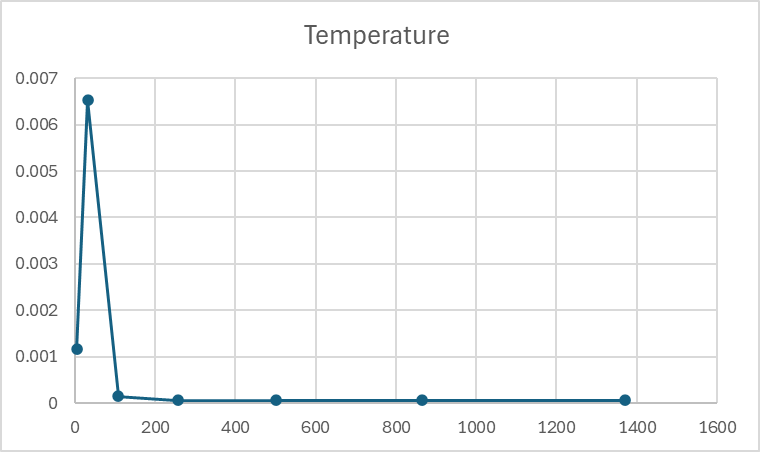
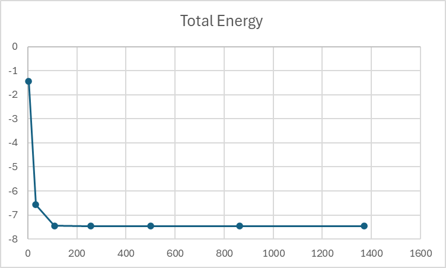
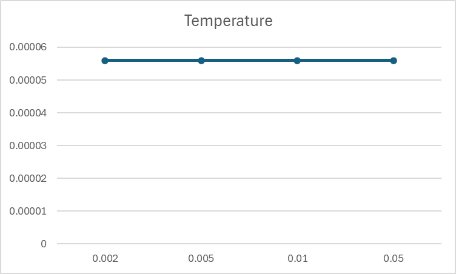
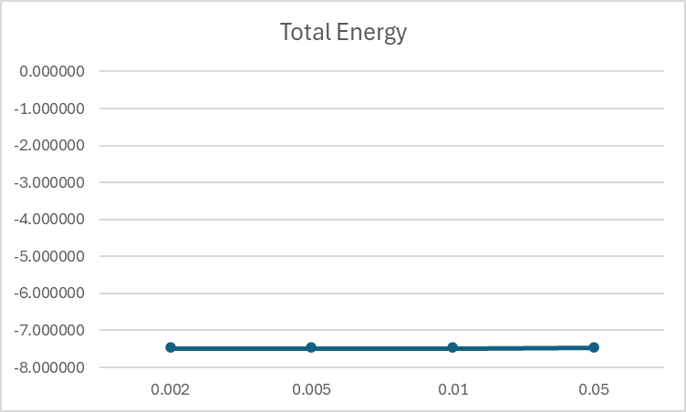
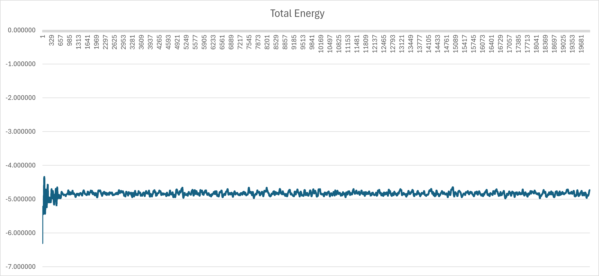
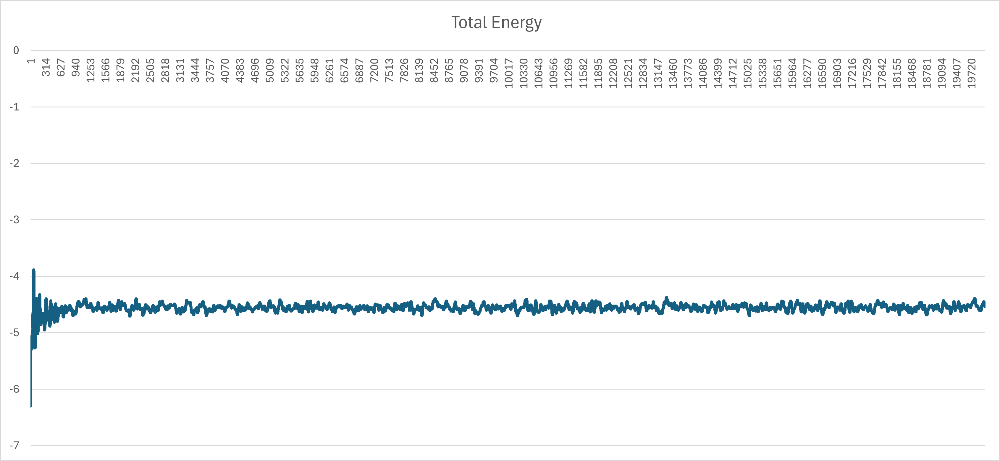
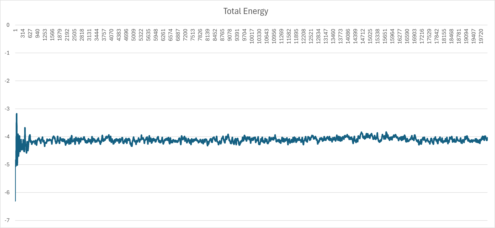
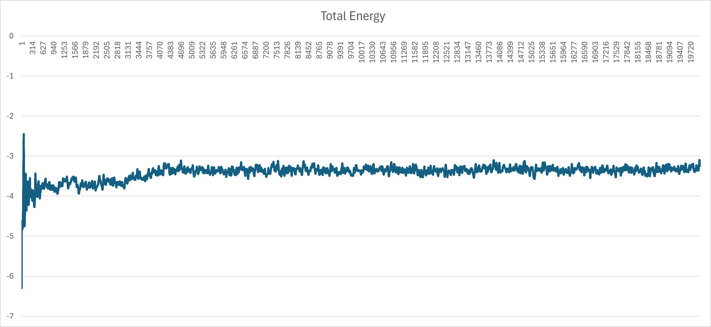
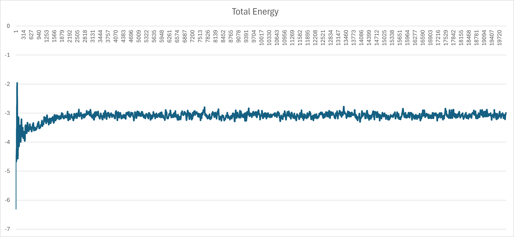
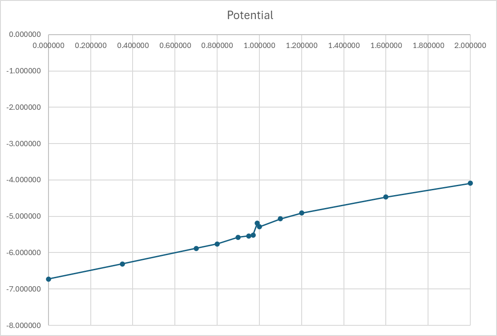

<!-- Para essa atividade utilizaremos os programas desenvolvidos por Furio Ercolessi e que podem ser obtidos livremente no endereço: https://github.com/itamblyn/FORTRAN/blob/master/md/mdx/md1.f90.

Baixe os arquivos crystal.f90 e md1.f90.  O programa crystal.f90 cria um arquivo de configuração com as posições dos átomos em uma rede FCC e o programa md1.f90 é o programa de dinâmica molecular (DM). Detalhes sobre os arquivos de entrada estão nos slides das aulas sobre DM.
(Questões baseadas em NH2043 - Física Computacional –  Prof. Luana)

a)  O objetivo deste exercício é verificar o efeito do número de átomos nos resultados do cálculo (análise de convergência).

Utilize o programa crystal para gerar amostras do sólido de LJ com parâmetro de rede de equilíbrio (valor fornecido na tela pelo programa) e considere diferentes tamanhos para a célula FCC (1x1x1, 2x2x2, 3x3x3,4x4x4, 5x5x5, 6x6x6, 7x7x7). Use o mesmo deslocamento máximo em todas as amostras (0.001). Para cada sistema, execute o programa de DM considerando 1000 passos de simulação, δt = 0.003, densidade constante (valor 0 na linha 6) e energia constante (valor −1 na linha 7).

Faça dois gráficos: um da energia total média em função do número total de átomos do sistema e outro da temperatura média em função do número total de átomos do sistema. Esses valores médios aparecem no fim do arquivo de saída do programa md1. Baseado nestes resultados diga qual o tamanho do sistema que você selecionaria para a simulação e justifique sua escolha.

(Observação: vários programas utilizados para fazer gráficos ligam os pontos diretamente. No entanto, em gráficos como os desse exercício é importante mostrar explicitamente os resultados obtidos.)

b)  O objetivo deste exercício é verificar o efeito do passo de integração. Dada as coordenadas iniciais (as obtidas pelo crystal) do sistema escolhido no MD1, faça diferentes simulações de DM para os seguintes passos de integração:

- 0.002 ; 0.005 ; 0.01 ; 0.05 (mude a linha 5 do arquivo de entrada em cada caso). Cada uma das simulações deve ser feita para um tempo total de 100 unidades de tempo.

Faça os gráficos da energia total (instantânea) e da temperatura (instantânea) em função do tempo total de simulação, para os diferentes tempos de integração. Analise os resultados e diga qual o valor de δt mais apropriado para essas simulações.

Obs: Utilize o mesmo deslocamento máximo da letra a no programa crystal (0.001).

c)  Nesse exercício estudaremos o comportamento de um sólido em função da temperatura. Uma maneira de determinarmos a temperatura de fusão de um sólido consiste em monitorar como a energia do sistema varia em função da tempe- ratura a partir de simulações de um sistema em diferentes condições termodinâmicas. Quando um material passa do estado sólido (ordenado) para o estado líquido (desorde- nado) ocorre uma liberação de energia, o chamado calor latente de fusão, o que provoca uma descontinuidade no gráfico E x T. A temperatura na qual esta descontinuidade ocorre pode ser utilizada como uma estimativa da temperatura de fusão do sólido.

Parte 1 - Programa crystal: considere o sólido de LJ e utilize 04 células em cada uma das direções x, y e z e deslocamento máximo de 0.001. Salve o arquivo com as posições dos átomos. Este arquivo será utilizado em todas as simulações deste exercício.

Parte 2 - Programa md1: Execute simulações com esse programa a partir do arquivo gerado na parte 1 para as seguintes condições termodinâmicas: densidade = 0.9 (coloque esse valor na linha 6), 20000 passos de integração, δt = 0.0025 e temperaturas (constantes em cada simulação): 0.7, 0.8, 0.95, 1.10 e 1.20. Para cada simulação mude o valor da linha 7 para a temperatura correspondente.

Parte 3 - Faça um gráfico da energia total instantânea em função do número de passos de simulação para todos os casos de temperatura. Analise os resultados.

Parte 4 - Faça um gráfico da energia potencial média em função da temperatura para as condições acima. Qual é a estimativa para a temperatura de fusão do sólido? Justifique sua resposta. Se achar necessário, realize novas simulações para valores intermediários de temperatura. -->

# Avaliação 8 - Questão 1

## A

Para a primeira parte do exercício, foi gerado um arquivo de configuração com as posições dos átomos em uma rede FCC utilizando o programa `crystal.f90`. Foram considerados diferentes tamanhos para a célula FCC (1x1x1, 2x2x2, 3x3x3, 4x4x4, 5x5x5, 6x6x6, 7x7x7) e o mesmo deslocamento máximo em todas as amostras (0.001). Para cada sistema, foi executado o programa de dinâmica molecular (`md1.f90`) considerando 1000 passos de simulação, δt = 0.003, densidade constante (valor 0 na linha 6) e energia constante (valor −1 na linha 7).

Analisando os dois graficos acima a melhor escolha seria a célula 4x4x4, pois a temperatura e a energia total são as mais estáveis, pois é que possue o menor numero de átomos, 256, e que se aproxima de valores de temperatura e energia total mais estáveis, perto do valor de convergência.

## B

Para a segunda parte do exercício, foram feitas diferentes simulações de dinâmica molecular para os seguintes passos de integração: 0.002 ; 0.005 ; 0.01 ; 0.05. Cada uma das simulações foi feita para um tempo total de 100 unidades de tempo.

Nessa parte é possivel observar que não diferença significativa entre os valores de energia total e temperatura para os diferentes valores de passo de integração, sendo assim o valor de 0.05 seria o mais apropriado para essas simulações, pois é o que tem menos custo computacional.

## C

Para os graficos de energia total instantânea em função do número de passos de simulação para todos os casos de temperatura e da energia potencial média em função da temperatura para as condições acima, foram feitas as seguintes simulações, para as seguintes temperaturas: 

* Energia total instantânea x número de passos de simulação a temperatura 0.7:

* Energia total instantânea x número de passos de simulação a temperatura 0.8:
  

* Energia total instantânea x número de passos de simulação a temperatura 0.95:

* Energia total instantânea x número de passos de simulação a temperatura 1.10:

* Energia total instantânea x número de passos de simulação a temperatura 1.20:

Ao olharmos os graficos acima notamos que todos começam a establizar a partir da 4000 passos de simulação, e que a energia total vai aumentando conforme a temperatura aumenta, para as temperaturas de 1.10 e 1.20 são as que mais demoram para estabilizar.

* Energia potencial média x temperatura:

Analisando o grafico de energia potencial média em função da temperatura, podemos observar uma descontinuidade na região da temperatura de 0.99, que seria a temperatura de fusão do sólido.
